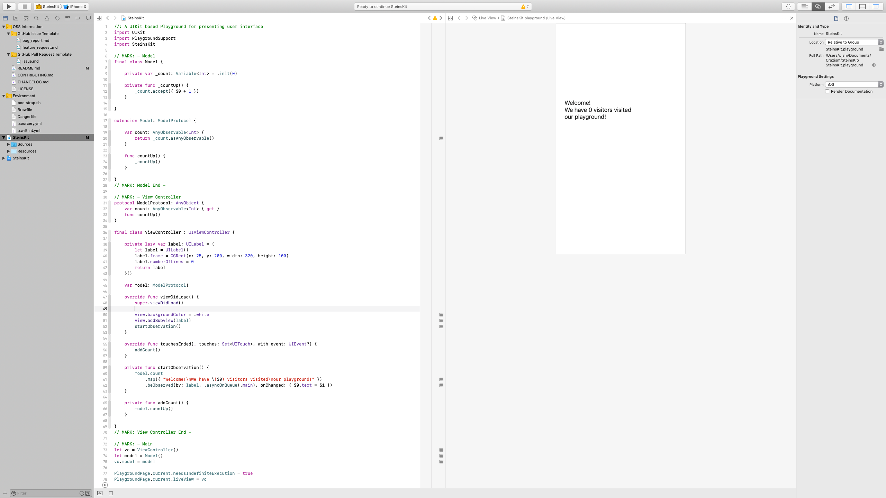

# SteinsKit

[](https://developer.apple.com/iphone/index.action)
[](https://developer.apple.com/swift)
[](https://github.com/Carthage/Carthage)
[](https://app.bitrise.io/app/5d9a1b8ef5e4230d)

## Tiny yet Easy-to-use Observer-Pattern implementation in Swift 

SteinsKit is a framework to help you implement *Observer Pattern* without any FRP concepts.

Please note that this framework hasn't been widely tested yet, and currently it's for iOS only.

Please open an issue or send me a pull request if you have any problems, better ideas or any other things you want me to know.

## Why SteinsKit

If you're a big fan of FRP, or you want to deeply dive into the world of Reactive Programming, probably libraries like RxSwift or ReactiveSwift would be a better choice for you.

However, if what you want is just a quick implement of Observer Pattern, and you don't want to care about the concepts in FRP like *Streams* or *Hot/Cold Observables*, you may want to try SteinsKit!

With SteinsKit, you don't have to care about what a stream is, or if the observable is hot or cold. The concept is very simple: you give the variable a new value, and all objects observing the variable receive the new value. That's it!

## Requirements

- iOS 11.0+
- Xcode 10.2+
- Swift 5.0+

## Installation

### Use Carthage

- Download and install [Carthage](https://github.com/Carthage/Carthage#installing-carthage).
- Add the following line to your [Cartfile](https://github.com/Carthage/Carthage/blob/master/Documentation/Artifacts.md#cartfile):

```txt
github "el-hoshino/SteinsKit"
```

- Run `carthage update`.
- Add the framework to your project.

### Manually

- Download the whole repository.
- Add the NotAutoLayout project file into your project.
- Build the framework.

## Usage

### TL;DR

You can check a demo code in Playground. It looks like this:

```swift
protocol ModelProtocol: AnyObject {
    var title: AnyObservable<String> { get }
}

final class MyViewController : UIViewController {
    
    var model: ModelProtocol!
    
    override func loadView() {
        let view = UIView()
        view.backgroundColor = .white

        let label = UILabel()
        label.frame = CGRect(x: 25, y: 200, width: 320, height: 60)
        label.textColor = .black
        label.numberOfLines = 0
        model.title.beObserved(by: label, onChanged: { $0.text = $1 })
        
        view.addSubview(label)
        self.view = view
    }
}

final class Model {
    
    private var _counter = 0
    private let _title: LazyVariable<String> = .init()
    
    func countUp() {
        _counter += 1
        _title.accept("Welcome!\nWe have \(_counter) people visited our playground!")
    }
    
}

extension Model: ModelProtocol {
    
    var title: AnyObservable<String> {
        return _title.asAnyObservable
    }
    
}

let vc = MyViewController()
let model = Model()
vc.model = model

// Present the view controller in the Live View window
PlaygroundPage.current.liveView = vc

model.countUp()
```



### Tell me more

SteinsKit uses `Variable` and `LazyVariable` classes to store the value, the closures to handle when value changes, and the weak references of the observers. So the approach is very simple:

1. Declare a `Variable` or a `LazyVariable`, and expose it as `AnyObservable`. Please note that if you declare a `Variable`, you have to give it an initial value, which you don't have to if you declare a `LazyVariable`.
2. Subscribe the `AnyObservable` through `beObserved(by:, onChanged:)` method. If needed, you can also insert `map(_:)` methods before subscribing it. And as you subscribing the `AnyObservable`, the latest value (if available) will be immediately reflected in your `onChanged` handler.
3. Put new values to the `Variable` or `LazyVariable` through `accept(_:)` method from the object that holds it, and all objects subscribe it receive the new value immediately.

You may notice that in the sample above, there is no `[weak object]` capture list, or subscription disposing declarations like `.disposed(by: disposeBag)` which you may be familiar with if you use RxSwift. This is because:

1. The object passed to `by:` parameter in `beObserved` method will be weakly referred in `Variable`. This makes the object acts like a `DisposeBag` in RxSwift, that when the object is released from memory, the subscription will also be released from the `Variable`.
2. The object passed to `by:` parameter in `beObserved` method will also be sent to `onChanged` handler closure as the first input parameter `$0`, and is already weakly captured inside the `beObserved` method. So you don't have to declare it in the capture list manually in your code, and in addition you can directly use it in your closure with `$1` as the latest value.

In addition, you can also pass a queue to `beObserved` method to specify which queue should the `onChanged` handler run with. For example:

```swift
model.title.beObserved(by: label, .async(.main), onChanged: { $0.text = $1 })
```

will make the `onChanged` handler running on `DispatchQueue.main` queue asyncly. You can choose from `.directly` (which is also the default specification if you don't pass anything to this parameter), `async(DispatchQueue)` and `sync(DispatchQueue)`. These settings work like below:

- `.directly`: The `onChanged` handler will immediatly run after the value changed, just on the queue which changed the value.
- `.async(DispatchQueue)`: The `onChanged` handler will run after the value changed, on the queue passed, using `DispatchQueue.async`. Handy for UI components as the subscriber to redraw with latest values on main thread.
- .`sync(DispatchQueue)`: The `onChanged` handler will run after the value changed, on the queue passed, using `DispatchQueue.sunc`. Always remember that this may cause a deadlock if you don't use the threads properly.

All the design described above makes it much simpler to write an Observer Pattern code.

## Known issues

- [ ] No enough tests yet, especially about the ARC.

## What doesn the name SteinsKit mean

It doesn't mean anything. El Psy Kongroo.

## License

SteinsKit is released under the Apache license. See [LICENSE](LICENSE) for details.
